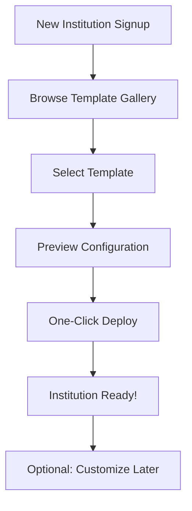

# How Educational Institutions Work: A Developer's Guide
# Building Benana - The Universal School Management Software: A Developer's Guide

> **Welcome to the Benana Open-Source School Management Software Project!** 🎓  
> This guide will help you understand how educational institutions operate so you can build software that truly serves schools and colleges.

## 📋 Table of Contents

- [What Are Educational Institutions?](#what-are-educational-institutions)
- [Two Main Areas of Operation](#two-main-areas-of-operation)
- [The Foundation: Certifications and Courses](#the-foundation-certifications-and-courses)
- [Course Structure: Years, Grades, and Subjects](#course-structure-years-grades-and-subjects)
- [Static Configuration vs. Dynamic Academic Years](#static-configuration-vs-dynamic-academic-years)
- [The Academic Year: The Most Important Concept](#the-academic-year-the-most-important-concept)
- [Summary for Developers](#summary-for-developers)
- [Contributing](#contributing)

---

## 🏫 What Are Educational Institutions?

Educational institutions come in many forms:

| Type | Examples |
|------|----------|
| **Schools** | Elementary, middle, high school |
| **Colleges** | Universities, community colleges |
| **Training Centers** | Vocational schools, coaching centers |
| **Tuition Centers** | Supplementary education |

> **💡 Key Point:** Despite their differences, they all share similar operational patterns that our software needs to handle.

---

## ⚙️ Two Main Areas of Operation

Every educational institution has two key operational areas:

### 🏢 1. Administration
- Finances and budgeting
- Human resources management
- Facilities management
- Student records and enrollment
- General operations

### 📚 2. Academics
- Curriculum delivery
- Teaching and learning processes
- Student assessments
- Educational outcomes
- Academic progress tracking

> **ℹ️ Important Note:** Some institutions have separate heads for academics and administration, while others have one person (like a principal) overseeing both areas.

---

## 🎯 The Foundation: Certifications and Courses

Before any school can operate, it must define **what it teaches**. This is the most basic building block:

### Examples of Certifications/Courses:

| Institution Type | Certification/Course Examples |
|------------------|-------------------------------|
| **Schools** | CBSE K-12, ICSE K-12, IB Program |
| **Colleges** | Bachelor of Engineering, MBA, Bachelor of Arts |
| **Training Centers** | Football coaching certification, music instrument courses |

### 🔑 Key Point for Developers:
A single institution can offer multiple certifications or courses. For example:
- A college might offer both engineering degrees **and** business degrees simultaneously
- A school might offer both CBSE **and** ICSE curricula

---

## 📊 Course Structure: Years, Grades, and Subjects

Once you know what the institution teaches, you need to understand **how it's organized**:

- **Years/Grades:** Most courses are divided into multiple years (Grade 1, Grade 2, etc.)
- **Subjects:** Each year has specific subjects that students must study
- **Progression:** Students move from one year to the next based on performance

### 📋 Example Structures:

<details>
<summary><strong>🏫 CBSE School (Class 5 to 10)</strong></summary>

```
CBSE Secondary Education (6 years)
├── Class 5: Mathematics, EVS, English, Hindi, Social Studies
├── Class 6: Mathematics, Science, English, Hindi, Social Studies, Computer Science
├── Class 7: Mathematics, Science, English, Hindi, Social Studies, Computer Science
├── Class 8: Mathematics, Science, English, Hindi, Social Studies, Computer Science
├── Class 9: Mathematics, Science, English, Hindi, Social Studies, Computer Science
└── Class 10: Mathematics, Science, English, Hindi, Social Studies, Computer Science
    └── Board Exam Year (External examination by CBSE)
```

**Key Points:**
- **Class 5:** Environmental Studies (EVS) instead of separate Science and Social Studies
- **Classes 6-10:** Science splits into Physics, Chemistry, Biology concepts
- **Class 10:** Major milestone with CBSE Board Examinations

</details>

<details>
<summary><strong>🎓 Engineering Degree (4 years, 8 semesters)</strong></summary>

```
Engineering Degree (4 years, 8 semesters)
├── Year 1
│   ├── Semester 1 (6 months): Mathematics-I, Physics-I, Chemistry, English, Engineering Graphics
│   └── Semester 2 (6 months): Mathematics-II, Physics-II, Programming Fundamentals, Environmental Studies, Workshop Practice
├── Year 2
│   ├── Semester 3 (6 months): Mathematics-III, Data Structures, Digital Logic, Engineering Economics, Technical Communication
│   └── Semester 4 (6 months): Mathematics-IV, Computer Organization, Database Systems, Operating Systems, Discrete Mathematics
├── Year 3
│   ├── Semester 5 (6 months): Software Engineering, Computer Networks, Web Technologies, Elective-I, Mini Project
│   └── Semester 6 (6 months): Compiler Design, Machine Learning, Mobile App Development, Elective-II, Internship
└── Year 4
    ├── Semester 7 (6 months): Cloud Computing, Cybersecurity, Elective-III, Major Project-I, Seminar
    └── Semester 8 (6 months): Artificial Intelligence, Elective-IV, Major Project-II, Industrial Training, Viva Voce
```

**Key Points:**
- **6-month cycles:** Each semester runs for approximately 6 months
- **Progressive complexity:** Subjects build upon previous semester knowledge
- **Practical components:** Labs, projects, and internships in later semesters

</details>

<details>
<summary><strong>⚽ Football Coaching Institute</strong></summary>

```
Football Coaching Certification (3 levels)
├── Beginner Level (3 months)
│   ├── Basic Skills: Ball control, passing, dribbling
│   ├── Physical Fitness: Running, stamina building
│   ├── Game Rules: Understanding football rules and positions
│   └── Basic Tactics: Simple formations and teamwork
├── Intermediate Level (6 months)
│   ├── Advanced Skills: Shooting, crossing, heading
│   ├── Position Training: Defender, midfielder, forward specific skills
│   ├── Team Strategy: Understanding formations (4-4-2, 3-5-2)
│   └── Match Analysis: Watching and understanding game tactics
└── Advanced Level (6 months)
    ├── Specialized Training: Goalkeeping, set pieces, leadership
    ├── Coaching Skills: How to train others, communication
    ├── Match Preparation: Pre-game strategy, mental preparation
    └── Certification Exam: Practical skills test + Theory exam
```

**Key Points:**
- **Skill-based progression:** Unlike academic years, focus is on practical abilities
- **Flexible duration:** Students can progress at different speeds
- **Age-based divisions:** Often divided by age (U-10, U-12, U-15, U-18, Adults)

</details>

---

## 🔄 Static Configuration vs. Dynamic Academic Years

> **⚠️ Crucial Concept:** Some configurations remain constant across academic years, while others change annually.

### 🏗️ Static Configurations (Rarely Change)

These are the foundational elements that typically stay the same year after year:

| Configuration Type | Description | Examples |
|-------------------|-------------|----------|
| **Certification Structure** | Basic framework of a course | CBSE K-12, Engineering Degree duration |
| **Subject Framework** | Core subjects and prerequisites | Math-I before Math-II |
| **Assessment Structure** | Examination patterns and grading | Semester system, passing criteria |

### 🔄 Dynamic Configurations (Change Periodically)

However, these configurations can change when governing bodies introduce updates:

#### 1. 📚 Curriculum Updates
- **CBSE Example:** In 2020, CBSE reduced the syllabus for Classes 9-12 due to COVID-19
- **Engineering Example:** Universities regularly update computer science subjects to include new technologies (AI, Machine Learning, Cloud Computing)

#### 2. 📝 Subject Modifications
- **Adding new subjects:** CBSE introduced "Artificial Intelligence" as an optional subject in 2019
- **Removing outdated subjects:** Many engineering colleges phased out subjects like "FORTRAN Programming"
- **Restructuring existing subjects:** Breaking down "Computer Science" into "Programming" and "Data Structures"

#### 3. 📊 Examination Structure Changes
- **CBSE Example:** Introduction of internal assessment weightage (20% internal + 80% external)
- **Engineering Example:** Shift from annual to semester system in many universities

### 🔍 Real-World Examples of Changes

<details>
<summary><strong>📋 CBSE Changes Timeline</strong></summary>

| Year | Change | Impact |
|------|--------|--------|
| **2018** | Introduction of "Health and Physical Education" as mandatory | All schools had to add new subject |
| **2019** | Launch of "Artificial Intelligence" curriculum for Classes 8-12 | Optional subject offering |
| **2020** | Reduction in syllabus content due to pandemic | Affected all grade levels |
| **2021** | Introduction of two-level Mathematics (Standard and Basic) for Class 10 | Students could choose difficulty level |

</details>

<details>
<summary><strong>🎓 Engineering Changes Timeline</strong></summary>

| Period | Change | Impact |
|--------|--------|--------|
| **2010s** | Addition of "Environmental Studies" as mandatory across all branches | All engineering colleges had to comply |
| **2020s** | Introduction of "Machine Learning" and "Data Science" subjects | New specialized tracks created |
| **Recent** | Emphasis on "Industry 4.0" and "IoT" related subjects | Curriculum modernization |

</details>

### 🛠️ Why This Matters for Software Development

Our school management software must be designed to handle both stability and change:

#### ✅ Requirements for Our System:

1. **🔧 Flexible Configuration System**
   - Allow administrators to modify subject lists without code changes
   - Support version control for curriculum changes
   - Enable easy rollback if changes need to be reverted

2. **📜 Historical Data Preservation**
   - Students who graduated in 2018 should still show their curriculum as it was in 2018
   - Transcripts and certificates must reflect the subjects as they existed during the student's time

3. **🔄 Smooth Transition Management**
   - Handle mid-year curriculum changes gracefully
   - Support gradual rollouts (new curriculum for new admissions only)
   - Maintain both old and new structures during transition periods

4. **📋 Regulatory Compliance**
   - Automatically update assessment patterns when governing bodies change rules
   - Generate reports in formats required by regulatory bodies
   - Maintain audit trails of all curriculum changes

---

## 🚀 FastConfig: Our Solution to Configuration Challenges

> **💡 The Problem:** Setting up a new educational institution's software can take days or weeks of complex configuration work. **Our Solution:** FastConfig - Get your ERP running in 10 minutes with zero manual configuration!

### 🍔 Fast Food Experience for School Software

Just like ordering at a fast-food restaurant, FastConfig provides **instant, preloaded configurations** for different institution types. No waiting, no complex setup - just pick and go!

#### 🎯 How FastConfig Works:

1. **🏫 Choose Your Institution Type** from our template gallery
2. **⚡ One-Click Setup** - All configurations applied automatically  
3. **🎉 Start Using** your ERP in 10 minutes

### 📚 Template Gallery

Our **public database** of preloaded configurations grows daily with contributions from the community:

| 🏷️ Template Category | 📋 Available Configurations |
|---------------------|---------------------------|
| **🏫 Schools** | K-12 CBSE, K-12 ICSE, K-12 IB, State Board Variants |
| **🎓 Colleges** | Engineering (4-year), MBA (2-year), Arts & Science |
| **👶 Preschools** | Montessori Style, Play-based Learning, Academic Focus |
| **🏋️ Training Centers** | Football Coaching, Music Academy, Dance School |
| **📖 Tuition Centers** | Subject-specific, Test Prep, Language Learning |
| **🔧 Vocational** | Technical Skills, Certification Courses |

### 🔧 What FastConfig Automatically Creates

When you select a template, FastConfig instantly sets up all backend logic:

<details>
<summary><strong>🎯 Example: K-12 CBSE Template Setup</strong></summary>

**Automatic Configuration includes:**

```yaml
Academic Structure:
  - Duration: 12 years (Class 1-12)
  - Academic Year: April to March
  - Assessment: Continuous (Classes 1-8) + Board Exams (10,12)

Class & Division Setup:
  - Classes: 1, 2, 3, 4, 5, 6, 7, 8, 9, 10, 11, 12
  - Divisions: A, B, C (customizable count)
  - Class Strength: 30-40 students per division

Subject Configuration:
  Class 1-5:    Hindi, English, Mathematics, EVS, Art, PT
  Class 6-8:    Hindi, English, Mathematics, Science, Social Science, Computer, Art, PT
  Class 9-10:   Hindi, English, Mathematics, Science, Social Science, Computer, Art, PT
  Class 11-12:  Stream-based (Science/Commerce/Arts)

Teacher Allocation Rules:
  - Primary Classes (1-5): Class Teacher + Subject Teachers
  - Middle Classes (6-8): Subject-wise Teachers
  - Senior Classes (9-12): Specialized Subject Teachers

Examination Pattern:
  - Continuous Assessment: 20%
  - Periodic Tests: 30%
  - Final Exam: 50%
  - Practical/Project: Variable by subject
```

</details>

<details>
<summary><strong>⚽ Example: Football Coaching Center Template Setup</strong></summary>

**Automatic Configuration includes:**

```yaml
Training Structure:
  - Levels: Beginner, Intermediate, Advanced
  - Age Groups: U-8, U-10, U-12, U-15, U-18, Adults
  - Session Duration: 90 minutes each

Skill Categories:
  Beginner:     Ball Control, Basic Passing, Rules
  Intermediate: Shooting, Tactical Awareness, Team Play  
  Advanced:     Leadership, Coaching Skills, Match Strategy

Coach Allocation:
  - Head Coach: Overall program management
  - Assistant Coaches: Age group specialists
  - Goalkeeper Coach: Specialized training
  - Fitness Trainer: Physical conditioning

Assessment Methods:
  - Skill Demonstrations: Monthly
  - Fitness Tests: Quarterly  
  - Match Performance: Ongoing
  - Theory Tests: Level completion

Equipment & Facilities:
  - Field Requirements: Full-size, Half-size, Mini pitches
  - Equipment List: Balls, Cones, Goals, Bibs
  - Safety Gear: First aid, Water stations
```

</details>

### 🔄 Backend Magic: Relationship Management

FastConfig automatically handles complex configuration relationships:

#### 📊 Configuration Relationship Matrix

| Element | Auto-Links To | Example |
|---------|---------------|---------|
| **Academic Year** | Classes, Subjects, Teachers | 2024-25 → Class 5A → Mathematics → Ms. Smith |
| **Course Structure** | Years, Semesters, Subjects | B.Tech → Year 2 → Semester 3 → Data Structures |
| **Classes & Divisions** | Students, Teachers, Timetables | Class 7B → 35 Students → Mr. Kumar → Period 1-6 |
| **Subject Allocation** | Teachers, Classes, Assessments | Physics → Mr. Patel → Class 9A,9B → Lab + Theory |

### 🛠️ Technical Implementation of FastConfig

```sql
-- FastConfig Template Structure
CREATE TABLE config_templates (
    id INT PRIMARY KEY,
    name VARCHAR(255),           -- "K-12 CBSE"
    category VARCHAR(100),       -- "School", "College", "Training"
    description TEXT,
    version VARCHAR(20),
    is_public BOOLEAN,
    created_by INT,
    downloads_count INT,
    rating DECIMAL(3,2)
);

CREATE TABLE template_configurations (
    id INT PRIMARY KEY,
    template_id INT,
    config_type VARCHAR(100),    -- "academic_year", "subjects", "classes"
    config_data JSON,            -- Complete configuration object
    dependencies JSON            -- What this config depends on
);

-- One-Click Application Process
CREATE TABLE institution_deployments (
    id INT PRIMARY KEY,
    institution_id INT,
    template_id INT,
    deployed_at TIMESTAMP,
    custom_modifications JSON,   -- Any post-deployment changes
    status VARCHAR(50)           -- "deployed", "customized", "migrated"
);
```

### 🎯 Benefits for Different Users

| 👥 User Type | 🎯 Benefit |
|-------------|-----------|
| **🏫 School Admin** | Start new academic year in minutes, not days |
| **💻 Developer** | Focus on features, not configuration code |
| **🤝 Community** | Share and improve templates together |
| **📈 Institution** | Reduced setup cost and faster time-to-value |

### 🔄 Template Evolution & Community Growth

#### 📈 How Templates Improve Over Time:

1. **👥 Community Contributions**: Institutions share their optimized configurations
2. **📊 Usage Analytics**: Popular features get highlighted in new templates  
3. **🔄 Regulatory Updates**: Templates automatically updated when CBSE/other boards change rules
4. **⭐ Rating System**: Best templates rise to the top based on user feedback

#### 🚀 Contributing to Template Gallery:

```bash
# Example: Adding a new template
git clone https://github.com/school-erp/fastconfig-templates
cd fastconfig-templates/templates/schools
cp -r cbse-k12 my-custom-cbse-variant
# Edit configuration files
# Submit pull request with your template
```

### 📱 FastConfig User Experience

#### 🎯 Institution Setup Flow:



#### ⚡ 10-Minute Setup Process:

1. **⏱️ 2 minutes**: Browse and select template
2. **⏱️ 3 minutes**: Review auto-generated configuration
3. **⏱️ 1 minute**: One-click deployment
4. **⏱️ 4 minutes**: Basic data entry (institution name, admin details)
5. **🎉 Ready**: Start using your ERP!

> **💡 Pro Tip**: You can always customize configurations later, but FastConfig gets you operational immediately with industry best practices built-in.

---

## 📅 The Academic Year: The Most Important Concept

> **🎯 The academic year is the heartbeat of any educational institution.** It's a recurring cycle that typically lasts 9-12 months and drives almost everything the institution does.

### 🚀 What Happens at the Start of Each Academic Year:

| Task | Description |
|------|-------------|
| **👩‍🏫 Teacher Assignment** | Assign teachers to specific subjects for each grade/year |
| **👨‍🎓 Student Allocation** | Assign students to their respective classes |
| **📅 Timetable Creation** | Create schedules for all classes |
| **🏫 Classroom Assignment** | Allocate physical spaces to each class |
| **👩‍🏫 Class Teacher Assignment** | Assign a primary teacher responsible for each class |
| **⬆️ Student Promotion** | Move students from lower grades to higher grades |
| **🆕 New Admissions** | Enroll new students into appropriate grades |

### 💻 Why This Matters for Development:

Our software needs to handle this annual cycle efficiently. The system must support:

- ⚡ Bulk operations for the start of academic years
- 🔧 Flexible course and subject management
- 🔄 Teacher and student assignment workflows
- 📅 Timetable generation and management
- 🏫 Classroom and resource allocation

---

## 📝 Summary for Developers

When building school management software, remember:

### 🎯 Key Principles:

1. **🔧 Flexibility is key:** Institutions vary widely in their structure and needs
2. **📅 Academic year cycles:** Most operations revolve around annual cycles
3. **🏗️ Hierarchical structure:** Courses → Years → Subjects → Classes → Students/Teachers
4. **⚖️ Dual operations:** Always consider both administrative and academic requirements
5. **📈 Scalability:** Institutions may offer multiple courses and serve hundreds or thousands of students
6. **🔄 Static vs. Dynamic configurations:** Design systems that handle both stable structures and periodic regulatory changes
7. **📜 Historical preservation:** Always maintain records of how things were at any given time
8. **🔄 Change management:** Build tools that help institutions transition smoothly when curricula evolve

### 🗄️ Technical Implementation Considerations

#### 🔧 Traditional Database Design:
```sql
-- Basic Database Design Example (Pre-FastConfig)
CREATE TABLE certification_templates (
    id INT PRIMARY KEY,
    name VARCHAR(255),
    duration_years INT,
    structure JSON -- static structure
);

CREATE TABLE curriculum_versions (
    id INT PRIMARY KEY,
    certification_id INT,
    version VARCHAR(50),
    effective_from DATE,
    effective_to DATE,
    changes JSON -- time-based changes
);
```

#### 🚀 FastConfig Enhanced Database Design:
```sql
-- FastConfig Template System
CREATE TABLE config_templates (
    id INT PRIMARY KEY,
    name VARCHAR(255),           -- "K-12 CBSE", "Football Academy"
    category VARCHAR(100),       -- "School", "College", "Training"
    description TEXT,
    version VARCHAR(20),
    is_public BOOLEAN DEFAULT TRUE,
    created_by INT,
    downloads_count INT DEFAULT 0,
    rating DECIMAL(3,2) DEFAULT 0,
    last_updated TIMESTAMP,
    regulatory_compliance JSON   -- Tracks compliance requirements
);

CREATE TABLE template_configurations (
    id INT PRIMARY KEY,
    template_id INT,
    config_type VARCHAR(100),    -- "academic_year", "subjects", "classes"
    config_data JSON,            -- Complete configuration object
    dependencies JSON,           -- What this config depends on
    auto_update_rules JSON       -- Rules for automatic updates
);

CREATE TABLE institution_deployments (
    id INT PRIMARY KEY,
    institution_id INT,
    template_id INT,
    deployed_at TIMESTAMP,
    custom_modifications JSON,   -- Post-deployment changes
    status VARCHAR(50),          -- "deployed", "customized", "migrated"
    rollback_data JSON           -- Backup for easy rollback
);

-- Legacy support for traditional configurations
CREATE TABLE subject_mappings (
    id INT PRIMARY KEY,
    curriculum_version_id INT,
    subject_name VARCHAR(255),
    year_level INT,
    semester INT,
    is_mandatory BOOLEAN,
    fastconfig_template_id INT   -- Links to FastConfig if used
);
```

#### 🔄 FastConfig API Endpoints:
```javascript
// Browse available templates
GET /api/fastconfig/templates?category=school&search=cbse

// Preview template configuration
GET /api/fastconfig/templates/{id}/preview

// Deploy template to institution
POST /api/fastconfig/deploy
{
  "template_id": 123,
  "institution_id": 456,
  "customizations": {
    "institution_name": "ABC School",
    "academic_year_start": "2024-04-01"
  }
}

// Get deployment status
GET /api/fastconfig/deployments/{deployment_id}/status
```

> **🔑 Key Insight:** This approach ensures that while the fundamental structure remains stable, the system can adapt to evolving educational requirements without disrupting ongoing operations.

---

## 🤝 Contributing

Understanding these fundamentals will help you build software that truly serves educational institutions and makes their complex operations more manageable.

### 🚀 Ready to contribute?

1. **Fork this repository**
2. **Read our [Contributing Guidelines](CONTRIBUTING.md)**
3. **Check out our [Issue Tracker](../../issues)**
4. **Join our [Discussion Forum](../../discussions)**

### 📚 Additional Resources

- [API Documentation](docs/api.md)
- [Database Schema](docs/database.md)
- [User Guide](docs/user-guide.md)
- [Development Setup](docs/development-setup.md)

---

**Made with ❤️ by the Open-Source Education Community**

> If you found this guide helpful, please ⭐ star this repository and share it with other developers working on educational software!
