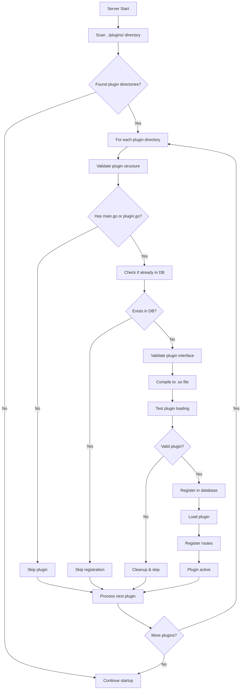
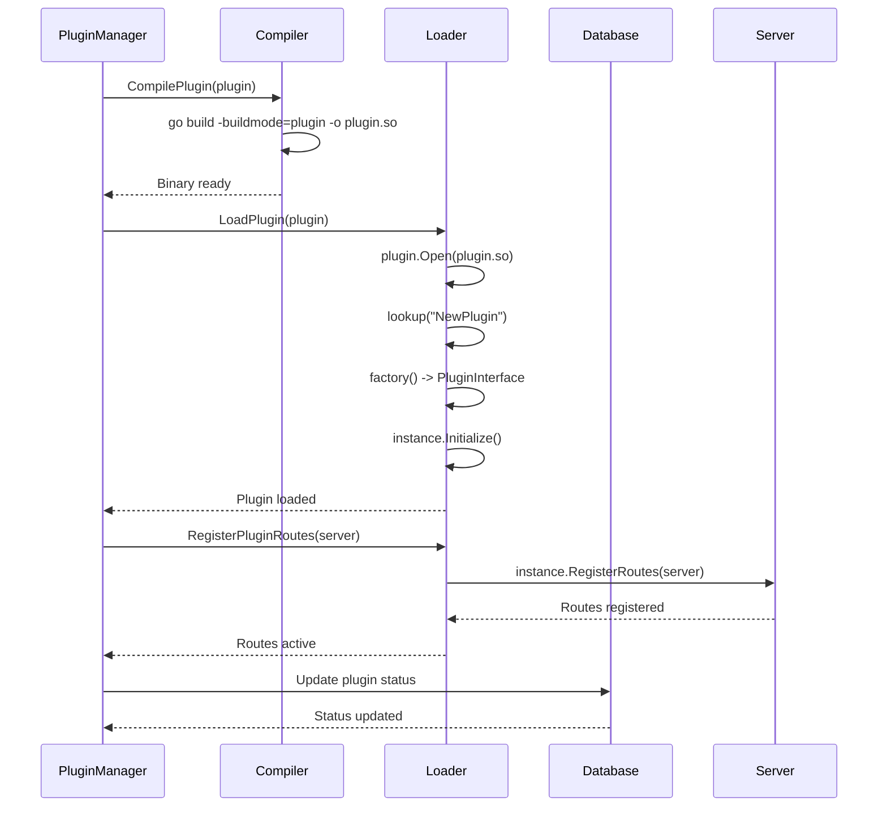
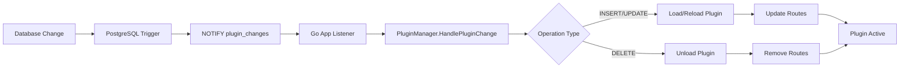

# Dynamic Plugin Architecture

## Overview

This system implements a **WordPress-style dynamic plugin architecture** for Go applications. Plugins are compiled at runtime to `.so` files and loaded dynamically without requiring server restarts.

## Architecture Components

### Core Components

```
┌─────────────────────────────────────────────────────────────┐
│                        Main Server                          │
│  ┌─────────────────┐  ┌─────────────────┐  ┌──────────────┐ │
│  │   HTTP Server   │  │ Plugin Manager  │  │ Database     │ │
│  │   (Fuego)       │  │                 │  │ (PostgreSQL) │ │
│  └─────────────────┘  └─────────────────┘  └──────────────┘ │
└─────────────────────────────────────────────────────────────┘
                               │
                               ▼
┌─────────────────────────────────────────────────────────────┐
│                   Plugin Subsystem                         │
│  ┌─────────────┐  ┌─────────────┐  ┌─────────────┐        │
│  │  Discovery  │  │  Compiler   │  │   Loader    │        │
│  │  Service    │  │             │  │             │        │
│  └─────────────┘  └─────────────┘  └─────────────┘        │
│                                                            │
│  ┌─────────────┐  ┌─────────────┐  ┌─────────────┐        │
│  │ Repository  │  │ Controller  │  │   Events    │        │
│  │             │  │   (API)     │  │ (Postgres)  │        │
│  └─────────────┘  └─────────────┘  └─────────────┘        │
└─────────────────────────────────────────────────────────────┘
                               │
                               ▼
┌─────────────────────────────────────────────────────────────┐
│                    Plugin Files                            │
│                                                             │
│  ../powertable/              ./bin/plugins/                 │
│  ├── main.go                 ├── powertable.so             │
│  ├── go.mod                  └── [other].so                │
│  └── plugin.yaml                                           │
│                                                             │
│  ../[other-plugin]/                                         │
│  ├── main.go                                               │
│  └── go.mod                                                │
└─────────────────────────────────────────────────────────────┘
```

## System Flow

### 1. Auto-Discovery Process



### 2. Plugin Loading Process



## Plugin Interface

### Required Interface Implementation

```go
type PluginInterface interface {
    // Initialize the plugin with any required setup
    Initialize(ctx context.Context) error
    
    // Get plugin metadata
    GetMetadata() PluginMetadata
    
    // Register routes with the server
    RegisterRoutes(server *fuego.Server) error
    
    // Cleanup resources when plugin is unloaded
    Cleanup(ctx context.Context) error
}
```

### Example Plugin Implementation

```go
package main

import (
    "context"
    "benana/types"
    "github.com/go-fuego/fuego"
)

type MyPlugin struct {
    metadata types.PluginMetadata
}

// Required: Export factory function
func NewPlugin() types.PluginInterface {
    return &MyPlugin{
        metadata: types.PluginMetadata{
            Name:        "myplugin",
            Version:     "1.0.0",
            Description: "My awesome plugin",
            Author:      "Developer",
        },
    }
}

func (p *MyPlugin) Initialize(ctx context.Context) error {
    // Plugin initialization logic
    return nil
}

func (p *MyPlugin) GetMetadata() types.PluginMetadata {
    return p.metadata
}

func (p *MyPlugin) RegisterRoutes(server *fuego.Server) error {
    fuego.Get(server, "/myplugin", p.handleGet)
    fuego.Post(server, "/myplugin", p.handlePost)
    return nil
}

func (p *MyPlugin) Cleanup(ctx context.Context) error {
    // Cleanup logic
    return nil
}

func (p *MyPlugin) handleGet(c fuego.ContextNoBody) (interface{}, error) {
    return map[string]string{"message": "Hello from MyPlugin!"}, nil
}

func (p *MyPlugin) handlePost(c fuego.ContextWithBody[map[string]interface{}]) (interface{}, error) {
    body, _ := c.Body()
    return map[string]interface{}{"received": body}, nil
}
```

## Database Schema

### Plugin Table
```sql
CREATE TABLE plugins (
    id VARCHAR(255) PRIMARY KEY,
    name VARCHAR(255) NOT NULL UNIQUE,
    description TEXT,
    version VARCHAR(100) NOT NULL,
    author VARCHAR(255),
    type VARCHAR(100) NOT NULL DEFAULT 'static',
    path VARCHAR(500),
    binary_path VARCHAR(500),    -- Path to compiled .so file
    source_path VARCHAR(500),    -- Path to source directory
    status VARCHAR(50) NOT NULL DEFAULT 'active',
    created_at TIMESTAMP WITH TIME ZONE NOT NULL DEFAULT CURRENT_TIMESTAMP,
    updated_at TIMESTAMP WITH TIME ZONE NOT NULL DEFAULT CURRENT_TIMESTAMP
);
```

### Plugin Endpoints Table
```sql
CREATE TABLE plugin_endpoints (
    id BIGSERIAL PRIMARY KEY,
    plugin_id VARCHAR(255) NOT NULL REFERENCES plugins(id) ON DELETE CASCADE,
    method VARCHAR(10) NOT NULL,
    path VARCHAR(500) NOT NULL,
    handler VARCHAR(255) NOT NULL,
    type VARCHAR(50) NOT NULL DEFAULT 'REST',
    created_at TIMESTAMP WITH TIME ZONE NOT NULL DEFAULT CURRENT_TIMESTAMP,
    updated_at TIMESTAMP WITH TIME ZONE NOT NULL DEFAULT CURRENT_TIMESTAMP
);
```

## API Endpoints

### Plugin Management API

| Method | Endpoint | Description |
|--------|----------|-------------|
| `GET` | `/plugins` | List all registered plugins |
| `GET` | `/plugins/{name}` | Get plugin details by name |
| `POST` | `/plugins/{name}/reload` | Force recompile and reload plugin |
| `POST` | `/plugins/{name}/toggle` | Enable/disable plugin |

### API Examples

#### List All Plugins
```bash
curl http://localhost:9999/plugins
```
```json
[
  {
    "id": "uuid-here",
    "name": "powertable",
    "description": "A plugin for creating powerful tables",
    "version": "0.1.0",
    "author": "Benana Team",
    "type": "dynamic",
    "status": "active",
    "source_path": "../powertable",
    "binary_path": "/abs/path/bin/plugins/powertable.so"
  }
]
```

#### Get Plugin by Name
```bash
curl http://localhost:9999/plugins/powertable
```

#### Reload Plugin
```bash
curl -X POST http://localhost:9999/plugins/powertable/reload
```
```json
{
  "message": "Plugin reload triggered successfully",
  "plugin": "powertable",
  "status": "reloading"
}
```

#### Toggle Plugin Status
```bash
curl -X POST http://localhost:9999/plugins/powertable/toggle
```
```json
{
  "message": "Plugin status updated successfully",
  "plugin": "powertable",
  "status": "inactive"
}
```

## Event-Driven Updates

### PostgreSQL Triggers
The system uses PostgreSQL triggers to automatically notify the application when plugins are modified:

```sql
CREATE OR REPLACE FUNCTION notify_plugin_change()
RETURNS TRIGGER AS $$
DECLARE payload JSON;
BEGIN
    -- Build notification payload
    payload = json_build_object(
        'operation', TG_OP,
        'table', TG_TABLE_NAME,
        'id', NEW.id,
        'name', NEW.name,
        'new_data', row_to_json(NEW),
        'timestamp', extract(epoch from now())
    );
    
    -- Send notification
    PERFORM pg_notify('plugin_changes', payload::text);
    RETURN NEW;
END;
$$ LANGUAGE plpgsql;
```

### Real-time Plugin Management


## Directory Structure

```
benana-workspace/
├── plugins/
│   ├── core/                    # Main server application
│   │   ├── main.go
│   │   ├── plugin/              # Plugin system code
│   │   │   ├── manager.go       # Plugin lifecycle management
│   │   │   ├── compiler.go      # Go build integration
│   │   │   ├── loader.go        # Dynamic .so loading
│   │   │   ├── controller.go    # HTTP API endpoints
│   │   │   ├── repository.go    # Database operations
│   │   │   └── service.go       # Business logic
│   │   └── bin/plugins/         # Compiled .so files
│   │       └── powertable.so
│   ├── powertable/              # Example plugin
│   │   ├── main.go              # Plugin implementation
│   │   └── go.mod
│   └── types/                   # Shared types
│       ├── plugin.go
│       └── plugin_interface.go
└── go.work                      # Go workspace
```

## Plugin Development Guide

### 1. Create Plugin Directory
```bash
mkdir ../plugins/myplugin
cd ../plugins/myplugin
```

### 2. Initialize Go Module
```bash
go mod init myplugin
```

### 3. Add Dependencies
```go
// go.mod
module myplugin

go 1.24.2

replace benana/types => ../types

require (
    benana/types v0.0.0-00010101000000-000000000000
    github.com/go-fuego/fuego v0.18.8
)
```

### 4. Implement Plugin
Create `main.go` with the required interface implementation (see example above).

### 5. Test Plugin
Start the server - your plugin will be auto-discovered, compiled, and loaded:
```bash
cd ../core
go run .
```

### 6. Verify Plugin
```bash
curl http://localhost:9999/plugins/myplugin  # Check registration
curl http://localhost:9999/myplugin          # Test plugin endpoint
```

## Key Features

### ✅ Auto-Discovery
- Plugins are automatically found in `../plugins/` directory
- No manual registration required

### ✅ Runtime Compilation
- Go source code compiled to `.so` files at runtime
- Uses `go build -buildmode=plugin`

### ✅ Interface Validation
- Plugins must implement `PluginInterface`
- Validation happens before registration

### ✅ Hot Reload
- Plugins can be reloaded without server restart
- `POST /plugins/{name}/reload`

### ✅ Database Integration
- Plugin metadata stored in PostgreSQL
- Real-time updates via PostgreSQL LISTEN/NOTIFY

### ✅ Event-Driven Architecture
- Database triggers notify application of changes
- Automatic plugin loading/unloading

### ✅ Route Management
- Plugin routes automatically registered with HTTP server
- Routes removed when plugin unloaded

## Comparison with WordPress

| Feature | WordPress (PHP) | This System (Go) |
|---------|----------------|------------------|
| **Discovery** | File scanning | Directory scanning |
| **Loading** | `include/require` | Dynamic `.so` loading |
| **Language** | PHP (interpreted) | Go (compiled) |
| **Performance** | Runtime parsing | Compiled native code |
| **Safety** | Runtime errors | Compile-time validation |
| **Hot Reload** | File modification | API-triggered reload |
| **Isolation** | Shared process | Separate `.so` files |

This implementation provides WordPress-like flexibility with Go's performance and type safety benefits.
